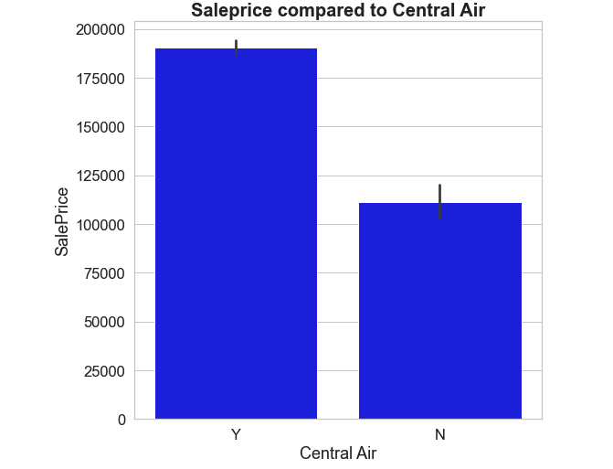

# AMES,IA HOUSING DATA PROJECT

## Problem Statement:
With a population of about 67,000 people and the 7th most populated city in Iowa, Ames is quickly becoming home to lots of individuals and families alike. That being said, many sellers are looking to take advantage of the market and sell their homes while demand is high.

Our realty firm, Coco Realty has decided to host a seller's seminar to show homeowners, how much their properties can sell for in this market. Using information from the county assessors office, I will attempt build a model that can predict the price of homes in the Ames, IA area.

- I will be exploring a few regression models such as Linear, Lasso and Ridge models for predicting sales price.
- After evaluating these three models, I will select which model works the best in giving the best predictions of home prices in Ames, IA.
- In addition to this, I will make note of features that can be improved in the home to increase its sale price.

# Data Dictionary:

A copy of the data dictionary used in this project can be found at the link below. This will give insight as to what each column and their values mean. This also includes an explanation of feature engineered variables

http://jse.amstat.org/v19n3/decock/DataDocumentation.txt

| Feature | Description |   
| :---    |   :----:    |
| PID     | Parcel Identification number|
| MS Sub Class| Type of dwelling involved in the sale|
|              |  020	1-STORY 1946 & NEWER ALL STYLES|
|              |  030	1-STORY 1945 & OLDER|
|              |  040	1-STORY W/FINISHED ATTIC ALL AGES|
|              |  045	1-1/2 STORY - UNFINISHED ALL AGES|
|              |  050	1-1/2 STORY FINISHED ALL AGES|
|              |  070	2-STORY 1945 & OLDER|
|              |  075	2-1/2 STORY ALL AGES|
|              |  080	SPLIT OR MULTI-LEVEL|
|              |  085	SPLIT FOYER|
|              |  090	DUPLEX - ALL STYLES AND AGES|
|              |  120	1-STORY PUD (Planned Unit Development) - 1946 & NEWER|
|              |  150	1-1/2 STORY PUD - ALL AGES|
|              |  160	2-STORY PUD - 1946 & NEWER|
|              |  180	PUD - MULTILEVEL - INCL SPLIT LEV/FOYER|
|              |  190	2 FAMILY CONVERSION - ALL STYLES AND AGES|
| MS Zoning    | Identifies the general zoning classification of the sale|
|              |  A	- Agriculture|
|              |  C -	Commercial|
|              |  FV -	Floating Village Residential|
|              |  I-	Industrial|
|              |  RH - Residential High Density|
|              |  RL -	Residential Low Density|
|              |  RP -	Residential Low Density Park|
|              |  RM -	Residential Medium Density|
|Lot Frontage  |  Linear feet of street connected to property|
|Lot Area      |  Lot size in square feet|
|Street        | Type of road access to property|
|              | Grvl - Gravel |
|              | Pave - Paved  |
|Alley         | Type of alley access to property |
|              | Grvl - Gravel |
|              | Pave - Paved  |
|              | NA   - No Alley Access |
|Lot Shape     | General shape of property |
|              | Reg - Regular |
|              | IR1 - Slightly irregular |
|              | IR2 - Moderately irregular |
|              | IR3 - Irregular            |
|Land Contour  | Flatness of the property |
|              |  Lvl -	Near Flat/Level |
|              |  Bnk- 	Banked - Quick and significant rise from street grade to building |
|              |  HLS-	Hillside - Significant slope from side to side |
|              |  Low	- Depression |
|Utilities     | Type of utilities available |
|              |  AllPub -	All public Utilities (E,G,W,& S) |
|              | NoSewr -	Electricity, Gas, and Water (Septic Tank) |
|              |  NoSeWa -	Electricity and Gas Only |
|              |  ELO	- Electricity only |
|Lot Config    |  Lot configuration |
|              |Inside -	Inside lot |
|              |Corner -	Corner lot |
|              |CulDSac	 - Cul-de-sac |
|              |FR2	- Frontage on 2 sides of property |
|              |FR3	 - Frontage on 3 sides of property |
|Land Slope    | Slope of property |
|              |Gtl -	Gentle slope |
|              |Mod -	Moderate Slope |
|              |Sev	- Severe Slope |
|Neighborhood  |Physical locations within Ames city limits |
|              |Blmngtn	- Bloomington Heights    |NridgHt - 	Northridge Heights |
|              |NWAmes - Northwest Ames |
|              |OldTown -	Old Town |
|              |SWISU	- South & West of Iowa State University |
|              |Sawyer	- Sawyer |
|              |SawyerW	- Sawyer West |
|              |Somerst	- Somerset |
|              |StoneBr	- Stone Brook |
|              |Timber -	Timberland |
|              |Veenker	-Veenker |
|Condition 1   | Proximity to various conditions |
|              |  Artery	Adjacent to arterial street|
|              |Feedr	Adjacent to feeder street	|
|              |Norm	Normal	|   
|              |RRNn	Within 200' of North-South Railroad |
|              |RRAn	Adjacent to North-South Railroad |
|              |PosN	Near positive off-site feature--park, greenbelt, etc |
|              |PosA	Adjacent to postive off-site feature |
|              |RRNe	Within 200' of East-West Railroad |
|              |RRAe	Adjacent to East-West Railroad |
|Condition 2   | Proximity to various conditions (if more than one is present) |
|              |  Artery	Adjacent to arterial street|
|              |Feedr	Adjacent to feeder street	|
|              |Norm	Normal	|   
|              |RRNn	Within 200' of North-South Railroad |
|              |RRAn	Adjacent to North-South Railroad |
|              |PosN	Near positive off-site feature--park, greenbelt, etc |
|              |PosA	Adjacent to postive off-site feature |
|              |RRNe	Within 200' of East-West Railroad |
|              |RRAe	Adjacent to East-West Railroad |
| Bldg Type    | Type of dwelling |
|              |1Fam	- Single-family Detached	|
|              | 2FmCon	- Two-family Conversion; originally built as one-family dwelling |
|              |Duplx- 	Duplex |
|              |TwnhsE -	Townhouse End Unit |
|              |TwnhsI -	Townhouse Inside Unit |
| House Style  | Style of Dwelling |
|              |1Story -	One story |
|              |1.5Fin -	One and one-half story: 2nd level finished |
|              |1.5Unf -	One and one-half story: 2nd level unfinished |
|              |2Story -	Two story |
|              |2.5Fin -	Two and one-half story: 2nd level finished |
|              |2.5Unf -	Two and one-half story: 2nd level unfinished |
|              |SFoyer - Split Foyer |
|              |SLvl	- Split Level |
|Overall Quality| Rates the overall material and finish of the house |
|               |  10	- Very Excellent |
|               | 9	- Excellent |
|               |8 -	Very Good |
|               |7 -	Good |
|               |6 -	Above Average |
|               |5 -	Average |
|               |4- Below Average |
|               |3 -	Fair |
|               |2 -	Poor |
|               |1 -	Very Poor |
|Overall Condition| Rates the overall finish of the house|
|                 |  10	- Very Excellent |
|                 | 9	- Excellent |
|                 |8 -	Very Good |
|                 |7 -	Good |
|                 |6 -	Above Average |
|                 |5 -	Average |
|                 |4- Below Average |
|                 |3 -	Fair |
|                 |2 -	Poor |
|                 |1 -	Very Poor |
|Year Built       | Original Construction date |
|Year Remod/Add   | Remodel date (same as year built if no remodeling or additions)|
|Roof Style       | Type of Roof |
|                 |Flat	Flat |
|                 |Gable	Gable |
|                 |Gambrel	Gabrel (Barn) |
|                 |Hip -	Hip |
|                 |Mansard -	Mansard
|                 |Shed -	Shed |
|Roof Matl        | Roof material |
|                 |ClyTile -	Clay or Tile |
|                 |CompShg -	Standard (Composite) Shingle |
|                 |Membran -	Membrane |
|                 |Metal -	Metal |
|                 |Roll -	Roll |
|                 |Tar&Grv - Gravel & Tar|
|                 |WdShake	- Wood Shakes |
|                 |WdShngl -	Wood Shingles |
| Exterior 1      | Exterior covering on house |
|                 |AsbShng - Asbestos Shingles |
|                 |AsphShn - Asphalt Shingles |
|                 |BrkComm -	Brick Common |
|                 |BrkFace - Brick Face |
|                 |CBlock - 	Cinder Block |
|                 |CemntBd - Cement Board |
|                 |HdBoard - Hard Board |
|                 |ImStucc -	Imitation Stucco |
|                 |MetalSd -	Metal Siding |
|                 |Other -	Other |
|                 |Plywood - Plywood |
|                 |PreCast - PreCast	|
|                 |Stone -	Stone |
|                 |Stucco	- Stucco |
|                 |VinylSd	- Vinyl Siding |
|                 |Wd Sdng - Wood Siding |
|                 |WdShing -	Wood Shingles |     
| Exterior 2      | Exterior covering on house (if more than one material) |
|                 |AsbShng - Asbestos Shingles |
|                 |AsphShn - Asphalt Shingles |
|                 |BrkComm -	Brick Common |
|                 |BrkFace - Brick Face |
|                 |CBlock - 	Cinder Block |
|                 |CemntBd - Cement Board |
|                 |HdBoard - Hard Board |
|                 |ImStucc -	Imitation Stucco |
|                 |MetalSd -	Metal Siding |
|                 |Other -	Other |
|                 |Plywood - Plywood |
|                 |PreCast - PreCast	|
|                 |Stone -	Stone |
|                 |Stucco	- Stucco |
|                 |VinylSd	- Vinyl Siding |
|                 |Wd Sdng - Wood Siding |
|                 |WdShing -	Wood Shingles |        
| Mas Vnr Area    | Masonry veneer type |
|                 | BrkCmn - Brick Common |
|                 | BrkFace - Brick Face |
|                 | CBlock - Cinder Block |
|                 | None - None |
|                 | Stone - Stone |
|Mas Vnr area     | Masonry veneer area in square feet |
|Exter Qual       | Evaluates the quality of the material on the exterior |
|                 | 5: Ex-	Excellent |
|                 | 4: Gd -	Good |
|                 | 3: TA -	Average/Typical |
|                 | 2: Fa	- Fair |
|                 | 1: Po -	Poor |
|                 | 0: NA - None |
|Exter Cond       | Evaluates the condition of the material on the exterior |
|                 | 5: Ex-	Excellent |
|                 | 4: Gd -	Good |
|                 | 3: TA -	Average/Typical |
|                 | 2: Fa	- Fair |
|                 | 1: Po -	Poor |
|                 | 0: NA - None |
| Foundation      | Type of foundation |
|	                |BrkTil -	Brick & Tile |
|                 |CBlock	- Cinder Block |
|                 |PConc - Poured Contrete |
|                 |Slab	- Slab |
|                 |Stone -	Stone |
|                 |Wood -	Wood |
| Bsmt Cond       | Evaluates the general condition of the basement |
|                 | 5: Ex -	Excellent |
|                 | 4: Gd -	Good |
|                 | 3: TA -	Typical - slight dampness allowed |
|                 | 2: Fa -	Fair - dampness or some cracking or settling |
|                 | 1: Po - Poor - Severe cracking, settling, or wetness |
|                 | 0: NA -	No Basement |
| Bsmt Qual       | Evaluates the height of the basement |
|                 | 5: Ex - 	Excellent (100+ inches)
|                 | 4: Gd -	Good (90-99 inches)
|                 | 3: TA -	Typical (80-89 inches)
|                 | 2: Fa -	Fair (70-79 inches)
|                 | 1: Po -	Poor (<70 inches
|                 | 0: NA -	No Basement
| Bsmt exposure   | refers to walkouts or garden level walls |
|                 | 4: Gd -	Good exposure
|                 | 3: Av - Average exposure (split levels or foyers typically score average or above)
|                 | 2: Mn -	Minimum exposure
|                 | 1: No -	No exposure
|                 | 0: NA -	No Basement
| Bsmt Fin Type 1 | Rating of basement finished area |
|                 | 6: GLQ - Good Living Quarters |
|                 | 5: ALQ -	Average Living Quarters |
|                 | 4: BLQ - Below Average Living Quarters |
|                 | 3: Rec -	Average Rec Room|
|                 | 2: LwQ -	Low Quality|
|                 | 1: Unf - Unfinshed|
|                 | 0: NA -	No Basement|
| Bsmt Fin Type 2 | Rating of basement finished area (if multiple types) |
|                 | 6: GLQ - Good Living Quarters |
|                 | 5: ALQ -	Average Living Quarters |
|                 | 4: BLQ - Below Average Living Quarters |
|                 | 3: Rec -	Average Rec Room|
|                 | 2: LwQ -	Low Quality|
|                 | 1: Unf - Unfinshed|
|                 | 0: NA -	No Basement|
|BsmtFin SF 1     | Type 1 finished square feet |
|BsmtFin SF 2     | Type 2 finished square feet |
|BsmtFin Unf SF   | Unfinished square feet |
|Total Bsmt SF    | Total square feet |
|Heating          | Type of heating |
|      	          | Floor -	Floor Furnace |
|                 | GasA -	Gas forced warm air furnace |
|                 | GasW -	Gas hot water or steam heat |
|                 | Grav -	Gravity furnace	|
|                 | OthW -	Hot water or steam heat other than gas |
|                 | Wall - 	Wall furnace |
| HeatingQC       | Heating quality and condition |
|                 | 5: Ex -	Excellent |
|                 | 4: Gd -	Good |
|                 | 3: TA -	Average/Typical |
|                 | 2: Fa -	Fair |
|                 | 1: Po -	Poor	|
| Central air     | Central air conditioning |
|                 | Yes |
|                 | No  |
| Electrical      | Electrical system |
|                 | 4: SBrkr -	Standard Circuit Breakers & Romex |
|                 | 3: FuseA - Fuse Box over 60 AMP and all Romex wiring (Average) |
|                 | 2: FuseF -	60 AMP Fuse Box and mostly Romex wiring (Fair) |
|                 | 1: FuseP -	60 AMP Fuse Box and mostly knob & tube wiring (poor) |
|                 | 0: Mix -	Mixed |
| 1st Flr SF      | First Floor square feet |
| 2nd Flr SF      | Second Floor |
| Low Qual Fin SF | Low quality finished SF (all floors) |
| Gr Liv Area     | Above grade (ground) living area in square feet |
| Bsmt Full Bath  | Number of full bathrooms in the basement |
| Bsmt half bath  | Number of half baths in the basement |
| Full baths      | Number of full baths above grade |
| Half baths      | Number of half baths  above grade |
| Bedrooms        | Bedrooms above grade |
| Kitchen         | Kitchens above grade |
| KitchenQual     | Quality of kitchen   |
|                 | 5: Ex -	Excellent |
|                 | 4: Gd -	Good |
|                 | 3: TA -	Typical/Average |
|                 | 2: Fa -	Fair |
|                 | 1: Po -	Poor |
| Functional      | Home functionality (Assume typical unless deductions are warranted) |
|                 | 7: Typ -	Typical Functionality |
|                 | 6: Min1 -	Minor Deductions 1 |
|                 | 5: Min2 -	Minor Deductions 2 |
|                 | 4: Mod -	Moderate Deductions |
|                 | 3: Maj1 -	Major Deductions 1 |
|                 | 2: Maj2 -	Major Deductions 2 |
|                 | 1: Sev -	Severely Damaged |
|                 | 0: Sal -	Salvage only |
| Fireplaces      | Number of fireplaces |
| FireplaceQU     | Fireplace quality |
|                 | 5: Ex - 	Excellent - Exceptional Masonry Fireplace |
|                 | 4: Gd -	Good - Masonry Fireplace in main level |
|                 | 3: TA -	Average - Prefabricated Fireplace in main living area or Masonry Fireplace in basement |
|                 | 2: Fa -	Fair - Prefabricated Fireplace in basement |
|                 | 1: Po -	Poor - Ben Franklin Stove |
|                 | 0: NA -	No Fireplace |
| Garage Type     | Garage location |
|                 | 2Types -	More than one type of garage |
|                 | Attchd - 	Attached to home |
|                 | Basment	 - Basement Garage |
|                 | BuiltIn	- Built-In (Garage part of house - typically has room above garage) |
|                 |CarPort -	Car Port |
|                 |Detchd	 - Detached from home |
|                 |NA	 - No Garage |
| Garage Yr Blt   | Year garage was built |
| Garage Finish   | Interior finish of the garage |
|                 | 3: Fin -	Finished |
|                 | 2: RFn -	Rough Finished |
|                 | 1:  Unf -	Unfinished |
|                 | 0: NA -	No Garage |
| Garage cars     | Size of garage in car capacity |
| Garage area     | Size of garage in square feet |
| Garage quality  | Garage quality |
|                 | 5: Ex -	Excellent |
|                 | 4: Gd -	Good |
|                 | 3: TA -	Typical/Average |
|                 | 2: Fa -	Fair |
|                 | 1: Po -	Poor |
|                 | 0: NA -	No Garage |
| Garage condition| Garage condition |
|                 | 5: Ex -	Excellent |
|                 | 4: Gd -	Good |
|                 | 3: TA -	Typical/Average |
|                 | 2: Fa -	Fair |
|                 | 1: Po -	Poor |
|                 | 0: NA -	No Garage |
|  Paved drive    | Paved driveway |
|                 |3: Y -	Paved |
|                 |2: P -	Partial Pavement|
|                 |1: N -	Dirt/Gravel|
| Wood Deck SF     | Wood deck area in square feet |
| Open Porch SF    | Open porch area in square feet |
| Enclosed porch   | Enclosed porch area in square feet |
| 3 Ssn Porch     | Three season porch area in square feet |
| Screen porch    | Screen porch area in square feet |
| Pool Area       | Pool area in square feet |
| Pool QC         | Pool Quality|
|		              |Ex -	Excellent |
|                 |Gd -	Good |
|                 |TA -	Average/Typical |
|                 |Fa - 	Fair |
|                 |NA -	No Pool |
| Fence            | Fence Quality |
|                 | 5: GdPrv -	Good Privacy |
|                 | 4: MnPrv -	Minimum Privacy |
|                 | 3: GdWo - 	Good Wood |
|                 | 2: MnWw -	Minimum Wood/Wire |
|                 | 1: NA -	No Fence |
| Misc Feature    | Miscellaneous feature not covered in other categories |
|                 | Elev -	Elevator |
|                 | Gar2 -	2nd Garage (if not described in garage section) |
|                 | Othr -	Other |
|                 | Shed - Shed (over 100 SF) |
|                 | TenC -	Tennis Court |
|                 | NA -	None |
| Misc Val        | dollar value of miscellaneous feature |
| Mo Sold         | Month sold |
| Yr Sold         | Year Sold |
| Sale Type       | Type of Sale |
|                 | WD - 	Warranty Deed - Conventional |
|                 | CWD	- Warranty Deed - Cash |
|                 | VWD -	Warranty Deed - VA Loan |
|                 | New -	Home just constructed and sold |
|                 | COD -	Court Officer Deed/Estate |
|                 | Con -	Contract 15% Down payment regular terms |
|                 | ConLw -	Contract Low Down payment and low interest |
|                 | ConLI -	Contract Low Interest |
|                 | ConLD -	Contract Low Down |
|                 | Oth -	Other |
| Sale conditions | Condition of Sale |
|                 | Normal -	Normal Sale |
|                 | Abnorml	- Abnormal Sale -  trade, foreclosure, short sale |
|                 | AdjLand -	Adjoining Land Purchase |
|                 | Alloca -	Allocation - two linked properties with separate deeds, typically condo with a garage unit |
|                 | Family -	Sale between family members |
|                 | Partial	 - Home was not completed when last assessed (associated with New Homes) |
| SalePrice       | Sale price in $$|

# Data Cleaning:
For the training set, we have 2051 rows of data and 81 columns, including our target variable, SalePrice.
I first checked for null values in the data set to know how much "missing data" we are working with. Now, missing is subjective as a null value doesn't always indicate missing data. For example, a home without a fence can be recorded as 'N/A' but it is a data point as it indicates the home does not have a fence.

Total null values are below:

Knowing these values, I went ahead and featured engineered some of the variables in the null table and other variables in the dataset to make them more useful for analysis.
**Note**: This is only a sample of features engineered not the full list

I also normalized the dependent variable(**SalePrice**) by using a log function which allows our data to closely resemble a normal distribution. This allows for more accurate calculation as the models being used make the assumption that the data is already normalized.

Here's a before and after:

**Hetroskadacity transformed to homoskedacity**:

Now that our dependent variable has been normalized, we see a transformation from hetroskedacity to homoskedacity. This means our errors or residuals(difference between our true and predicted values) now have a constant value rather than fluctuating values with every increase in the independent variable. Here's what it looks like now using one of the independent variables *Gross living Area*

# Exploratory Data Analysis:
Here I will be describing some of the findings of our data.

#### Correlation of dependent variables to SalePrice:

- Correlations tell us how closely related the values we put in (independent variables) affect the outcome we are trying to figure out (dependent variables).
- For this particular problem, we are trying tp figure out how the features of a home, including the neighborhood it's in affect how much it will sell for.
- These show how all the independent variables correlate with the dependent. **Overall Quality** takes the number one spot with a correlation of 80 percent . The better a home's overall quality is, the higher the sale price and vice versa, holding all other factors constant.

#### Gross living Area:

- There's a positively linear relationship between gross living area and Sale price. The greater the gross living area, the higher the sale price and vice versa.

#### Dwelling Type (MS Subclass):

- As listed in the county files, an MS Sub class identifies the dwelling type of the home. An MS Sub Class of 75 means that the house is a 2 1/2 story structure. This would mean that the most expensive homes in Ames, IA tend to be the 2 1/2 story houses, signifying that the town is oriented more towards families.

#### Neighborhoods:

- The most expensive neighborhood by Saleprice is *StoneBr*. On average, houses in this neighborhood sell for just above $350,000.

#### Garage Finishing:

- A fully finished garage interior (3.0) in the Ames, IA area garners a sales price of about \\$250,000 on average; A \\$40,000 increase compared to a roughly finished garage (2.0)

#### Overall Quality:

- There is a very linear relationship between overall quality and sale price. The better the material and finish of the house, the higher the selling price. This can be a point to make to sellers looking to sell their homes for top dollar

#### Pool:

- Having a pool significantly increases Sale price. On average, sellers can expect at least \\$42,421 more in Sale price if their home includes a pool, holding all other values constant.

#### Year Remodeled and Year Built:

- This visual shows that homes built and or remodeled in later years (especially after 2000) command the highest price in this market.

#### Driveway:

- On average, having a fully paved driveway results in. a 68.49% increase in Sale Price from a partial driveway, holding all other factors constant. Another selling point to get clients to fully pave their driveways rather than doing a partial or dirt driveway.

#### Central Air:

- Homes in Ames, IA with central air sell for over $60000 more than homes without one, holding all other values constant. Another selling point for clients. Further analysis will be needed to know the actual value of central air in each neighborhood in Ames, IA.

# Modeling
For this section, I focused on using regression models as finding predictive values of homes is the major goal of this project. The three models I will use in this section are **Linear, Lasso and Ridge regression**.

Something worth noting is that all three models above focus on reducing the errors between the true and predicted values; Their methods however vary.

#### Linear Regression:

- The linear regression model is focused on the least squared objective, that is reducing errors between true and predicted values. For this particular project, the model scored a whopping 94.8% on the training set and 91.5% on the testing set. Since the testing set is the true capability of the model, it is safe to say that according to the Linear model, 91.5% of variance in the Sale price is caused by the independent variables such as (gross living area, overall quality, all 220 independent features).

#### Lasso Regression:

- Lasso follows the same objective as linear regression of reducing errors between the true and predicted values but does so by adding what is called a "penalty". It also has a cool addition called "feature selection" that reduces variables that aren't contributing very much to the model to zero. This allows us to find which variables are really doing the work in adding to the model.

- The lasso model gives us a training score of 94.4% and 92% testing. This means that 92% of the variance in sales price is caused by the independent variables. As mentioned before, feature selection is one of the model's caveat. Here are a list of the top 10 features that affected the model's score the most.

#### Ridge Regression:

- Ridge also follows the same objective as lasso and linear and also using a penalty scale that is decided based on the data we input. The ridge model a 94.8 % in training and 91.7% in testing.

# Model Selection:

All three models had a healthy range in testing scores between 91 - 92%. However in the end, **Lasso model** appeared to have the least variance in its training and testing score by a very slight margin so therefore it is our chosen model.

# Recommendations!

- After our findings we can now recommend a few things that the homeowners in order to increase the value of their homes.
- As shown above, Gross living area, the year built, Basement SF, Garage area and proximity to various conditions (Condition_1 Normal) are all things that affect the price but are outside of a homeowner's control. On the other hand, **'overall quality' and overall condition** are something within the owner's purview. Here are a few more:

 **Driveway**: As mentioned above, homes with a paved drive way saw a 68.49% increase in Sale price compared to driveways that were partially paved. Clients are fully advised to pave their driveways if within their budget.

 **Kitchen Quality**: While the data makes it difficult to classify what is considered 'excellent' when it comes to kitchen quality, it is safe to say that aiming for the excellence (5) standard will draw in far more dollars than any of the other categories. Homes with an 'excellent' rating for the kitchen tend to sell over $100000 higher on average than homes with a good (4) rating.

 

 **Sale Type**: In Ames, IA the market is ruled by buyers who come in with low interest contracts, such as an FHA loan. It would be in the seller's best interest to look out for buyers with this type of financing, as the properties they're interested in tend to sell for higher prices.

 

# Shortcomings of this project:
- As outlined above, these are a few improvements a home owner can make to increase the likelihood of their homes selling for a higher price. It is important to not that while our model can predict accurately 92% of the time, working with a knowledgable licensed real estate agent is the best way to get the most accurate value of your home as they have first hand information on what a particular market is like.

- For instance, it was previously noted that the best neighborhood or the highest selling neighborhoods were **StoneBr**, **Nridght** , **Noridge , and Grnhill**.  But why were these Neighborhoods the most expensive? We are missing valuable information on what amenities are close to these neighborhoods that can affect the price. Things such as proximity to grocery stores, public parks and schools are just a few of those amenities but not an extensive list.

- Also, the real estate market it self tends to have sub markets even within a particular town. Homes that appeal to a particular buyer may not appeal to another so more specialized knowledge is required to know how different features in a home affect a specific submarket within Ames, IA.

# Conclusion:
- Overall, our firm was able to get a 92% prediction accuracy of home prices in Ames, IA based on the information we were given by the county's assessors office. We would also be thrilled to offer our services for homeowners looking to sell their properties. We have some of the most qualified and leading agents in the industry who are well informed about the Ames,IA market and can further assist in getting an even more accurate price. We look forward to working with you!
